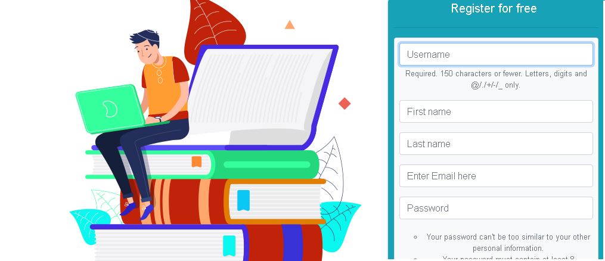
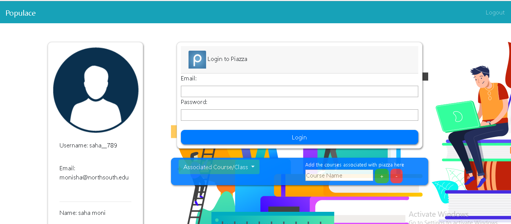
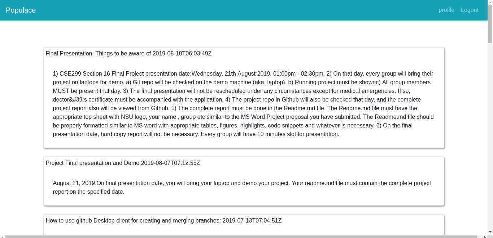
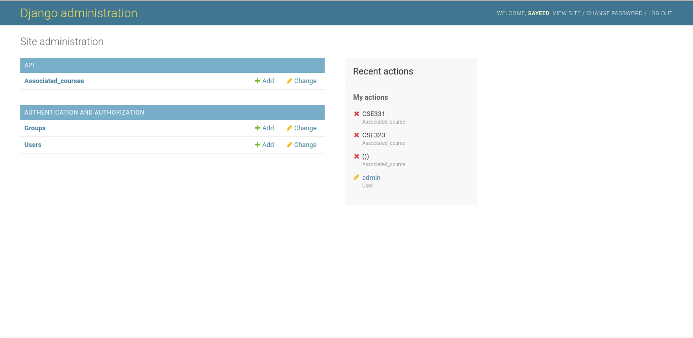

  

                                        

  <h1 align="center">Project Name: Populace</h1>
  <h2 align ="center">Course Number: CSE 299 
  Section:16 
  Semester: Summer 2019  
  Faculty Name: Shaikh Shawon Arefin Shimon</h2>
  <h3 align="center">Student Name: Sayeed Md. Shaiban 
  Student ID: 1621193042 
  Email: sayeed.shaiban@northsouth.edu   
  Student Name: Monisha Saha 
  Student ID: 1631667042 
  Email: monisha.saha@northsouth.edu   
  Date prepared: 11/06/2019</h3>   

<h2> Project Name: Populace </h2> 
<h3 id="table-of-contents">Table of contents</h3>

<ol>
  <a href="#introduction"><li>Introduction</li> </a>
  <a href="#features"><li>Software Specification</li> </a>
  <a href="#technology"><li>Technology</li> </a>
  <a href="#businessplan"><li>BusinessPlan/Monetization</li></a> 
  <a href="#conclusion"><li>Conclusion</li></a> 

</ol>
 

<h2 id="#introduction">1. Introduction</h2>
<h3>1.1 Project Idea:</h3>

At present times we have various web based tools like google-classroom and piazza to manage resource with a large group of people. These are specially used by educational institutions (e.g. school, college, university) and other organization to communicate with a large number of people, to create workflow etc. But often using different sites simultaneously causes a lot of clutter and becomes cumbersome to keep track of. Hence we offer ‘Populace’ which is a web based application. The reason it stands out from the rest is because it will combine all this separate existing platform into one single platform. By signing in to ‘Populace’ users will be able to see posts made on the other existing web applications and also make their own query. It will therefore be a gathering place especially for students and for people who wants a one-stop solution to keep track of all the accounts in different web platform. Thus creating a better workflow.
Primarily, the two platforms that we will include are ‘Google Classroom’ and ‘Piazza’. In the future we also plan to add other platforms similar to the above mentioned names.

<h2 id="features">2. Software Specification</h2>
This project has the following features -
<h3>2.1 User Registration:</h3>
  To access any platform (e.g.piazza,google classroom) users first have to register. Users must include username, firstname, lastname,email and password. The username will be used as a primary key to identify unique users. And so username will have to be unique. And it must contain 150 characters or fewer characters. Letters, digits and @/./+/-/_ are permitted only.
    
    
 

    
   Figure 1.0
 

 <h3>2.2 Login to a specific platform :</h3>
  The main feature of ‘Populace’ is that users will be able to view different platforms on one window after logging in once. This section is know as the profile. The users information is shown on the left as seen in figure 2.0. 
   

  

   
  Figure 2.0

 
 
  
Currently the following functions are available -
  

    * Users can see all their subject/course in the specific platform. 
    * Users can add or delete their subject/courses. To easy view which platform contains what subject 
    * Users will also be able to see posts of the specific subject/course sorted by subject and recent to old.
    

  

   
  Figure 3.0

  
<h3>2.3 Admin Panel:</h3>
There's also a Admin panel from which the admin can delete unwanted users. Assign new admins with filtered permission and monitor activities.

 
Figure 4.0

 <h2 id="#technology">3. Technology</h2>
 <h3>3.2 Proposed Technology Stack: </h3>
 
For UI design we decided to use Bootstrap. Bootstrap is a free and open-source CSS framework directed at responsive front-end web development. It contains CSS and JavaScript-based design templates for typography, forms, buttons, navigation and other interface components. Bootstrap will be used over the usual HTML and CSS. And for the backend we will be using Express.js. It is a web application framework. It is a minimal and flexible Node.js web application framework that provides robust set of features.

 Finally, for the database requirement we have opted to use a NoSQL database. And so we have decided to use MongoDB for the projects database requirement.  The reason for doing so is because we have only three entities:

<ul>
    <li> USER: Will keep info about the users signing in the application. </li>
    <li>PLATFORM: The platform information for the signed in USER entity.</li>
    <li>COURSE_INFO: The name of the course/subject associated with the specific platform</li>
</ul> 

 <h3>3.2 Implemented Technology Stack: </h3>
 
Due to npm api for piazza being old and unusable we have decided to switch our project from node.js to Django.For which our project specification has changed. Django is a high level python-based free and open-source web framework.

 For the database requirement we have opted to use a SQL database that comes with Django by default And so we have decided to use sqlite3 for the projects database requirement.

<h5>3.2.1 Design Pattern: </h5>
 
By default the Django framework follows the model-view-template pattern which a close immitation of the Model-view-controller. We decided to stay with this MVT pattern
To get the data from the other platforms we used the following APIs–

  * [Google Classroom Link](https://developers.google.com/classroom/quickstart/python)
  * [Piazza Link](https://pypi.org/project/piazza-api/) 

<h2 id="businessplan">4. BusinessPlan/Monetization</h2>

Google AdSense is the easiest way to monetize a website. It is designed for website developers to display photos, videos, texts on their website.  There are different types of ads available in Google AdSense. If our website is Google AdSense approved, Google will post ads on our website. Therefore, we can earn per view. On the other hand, our website can also be used by universities, schools and colleges as a means for them to communicate with their students, so we can make these organizations use our website as their own personal site. It will help the students in their studies. Because they will find Google classroom and piazza in one platform. It will save their time and keep them organized. So we can also approach these educational institutions to adopt our site to their system.

<h2>5. Conclusion</h2>

In summary Populace is a web-based software that tries to organize life by bringing several platforms together. In this project we achieved most of the functionalities proposed. Except the Business monotization plan using Google-AdSense. We also didn't implement the function of being able to post to the specific platform in this version of the software. In future, we plan to implement these missing functionalities and make the platform even better.

